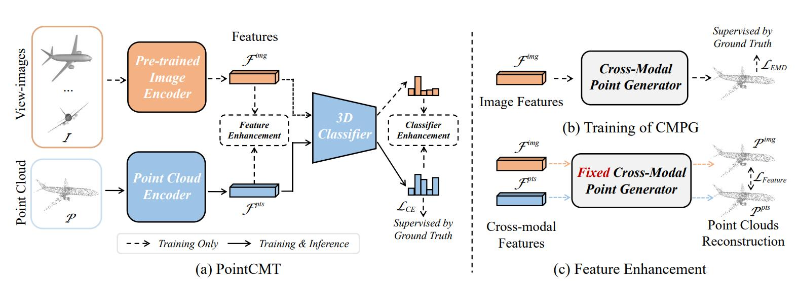

# PointCMT
This repository is for **PointCMT** introduced in the following paper

[Xu Yan*](https://yanx27.github.io/), Heshen Zhan*, Chaoda Zheng, Jiantao Gao, Ruimao Zhang, Shuguang Cui, 
[Zhen Li*](https://mypage.cuhk.edu.cn/academics/lizhen/), 
"*Let Images Give You More: Point Cloud Cross-Modal Training for Shape Analysis*", NeurIPS 2022 :smiley: [[arxiv]](https://arxiv.org/pdf/2210.04208.pdf).



If you find our work useful in your research, please consider citing:
```latex
@InProceedings{yan2022let,
      title={Let Images Give You More: Point Cloud Cross-Modal Training for Shape Analysis}, 
      author={Xu Yan and Heshen Zhan and Chaoda Zheng and Jiantao Gao and Ruimao Zhang and Shuguang Cui and Zhen Li},
      year={2022},
      booktitle={NeurIPS}
}

@InProceedings{yan20222dpass,
      title={2DPASS: 2D Priors Assisted Semantic Segmentation on LiDAR Point Clouds}, 
      author={Xu Yan and Jiantao Gao and Chaoda Zheng and Chao Zheng and Ruimao Zhang and Shuguang Cui and Zhen Li},
      year={2022},
      booktitle={ECCV}
}
```
Our another work for cross-modal semantic segmentation (ECCV 2022) is released [HERE](https://github.com/yanx27/2DPASS).

The code will be released soon...
